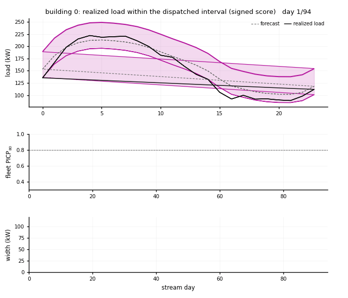

# Cost-Optimal Asymmetric Conformal Calibration for Degraded Federated Load Forecasting

Reference implementation accompanying the paper.

A fleet of 60 buildings trains one federated forecaster. Each building wraps its
forecasts in an Adaptive Conformal Layer (ACL) that re-sizes the prediction
interval daily from realized errors, scoring **signed** residuals so the upper
and lower radii are set independently. The cost-optimal coverage target is
either set in closed form by a newsvendor rule when reserve costs are published,
or learned online by a two-segment UCB bandit from daily settlement bills when
they are not. The deployment stage runs as a digital twin at two fidelities: a
single-process simulator, and a production mirror in which meters publish daily
batches over MQTT into a keyed Kafka log consumed by a stateful ACL processor,
with a served control-room dashboard.

## Headline results

Under complete telemetry degradation, on 60 BDG2 buildings:

| | symmetric score | signed score |
|---|---|---|
| nominal 80% interval width | 132.9 kW | **67.7 kW** |
| calibration-attributable cost | \$250/day | **\$123/day** |

\$123/day compares against \$526 under fleet-pooled calibration and \$280 under
the best static client-local baseline. Where tariffs are unobservable, the
bandit cuts bills by 7.3% in the first replayed season and reaches 11.7% in the
fourth, which is the benchmark available to an operator who knows the rates.

## Demo

`assets/dashboard_replay.html` is a standalone replay of the control room: six
replayed seasons, Chart.js embedded, no network calls. It shows a mid-horizon
degradation event strip the recent-load history, the frozen calibrator collapse
to about 0.38 coverage while the ACL widens and returns to within 0.02 of
nominal, and the bandit learn its per-segment targets from daily bills.

**To view it, download it and open the file in a browser.** Clicking it here
will not work: GitHub shows the source of an HTML file rather than rendering it.
Either clone the repository, or use the Download raw file button on that file's
page, then open the saved copy. It is self-contained, so it runs offline.



Above: building 0 under the signed score. The dispatched band sits **off-centre**
on the forecast, because the two radii are estimated separately, and that offset
is the per-building bias federated averaging leaves behind. A symmetric radius
has to widen both bounds to absorb it, so it pays for the offset twice. The
event lands halfway through; width steps up, coverage dips and recovers.

`twin_v2.ipynb` regenerates both the animation and the replay into `model_out/`.

## Data

The 60 client files in `bdg2_federated_out/clients/` are derived from Building
Data Genome 2:

- Zenodo, with a DOI: https://doi.org/10.5281/zenodo.3887306
- GitHub: https://github.com/buds-lab/building-data-genome-project-2

Each holds hourly load, weather and calendar features for one building, split
into train, validation, calibration and test. They ship so that training can be
re-run from scratch, not only reproduced from the saved weights.

BDG2 is CC BY-SA 4.0, so the parquets are too, and so is anything derived from
them. The code is MIT. See `LICENSE` for the split and for what was changed.

BDG2 itself is not re-hosted here. `data/` is empty, and `data/README.md` names
the three files to download if you want to rebuild the parquets from the raw
dataset: the cleaned electricity meter, the weather table and the metadata
table, about 196 MB together. `bdg2_federated_split.ipynb` is the recipe.

## Repository layout

`paper3_fed_load/` is the project folder as the notebooks expect to find it.
Its tree is flat on purpose: both notebooks load their scripts with
`exec(open(f"{PROJECT_DIR}/name.py").read())` and read artifacts from
`PROJECT_DIR/model_out`. Nothing inside it should be rearranged.

```
paper3_fed_load/
  model_federated_core_v5_clean.ipynb   FedAvg training, dose-response sweep,
                                        calibrators, economics, figures
  twin_v2.ipynb                         brokers, dashboard, mirror, frozen
                                        replay, figures
  bdg2_federated_split.ipynb            builds the per-building parquet clients
  bdg2_profile.ipynb                    dataset profiling

  *.py                                  22 scripts, loaded by the notebooks
    twin_mirror_signed_v2.py              the Mosquitto and Kafka mirror
    twin_replay_signed_v2.py              outage replay, writes dt_live.pdf
    twin_live_signed_v2.py                the animation
    the other 19                          the research pipeline

  bdg2_federated_out/
    clients/                            60 per-building parquet files, the
                                        input to training
    manifest.json
  bdg2_profile_out/                     building profile and the candidate
                                        client list the split notebook reads
  data/                                 EMPTY, and only needed for the optional
                                        rebuild. The raw BDG2 dataset is not
                                        re-hosted; data/README.md names the
                                        three files and where to get them.

  model_out/                            EMPTY. Everything the notebooks
                                        generate lands here: result CSVs, the
                                        trained backbones, every figure, the
                                        dashboard replay. See
                                        model_out/README.md for which section
                                        writes what.

assets/                                 the animation and the standalone
                                        dashboard replay, for the README
```

The client parquets ship, so training can be re-run from scratch rather than
only reproduced from saved weights.

## Running it (Google Colab)

**Nothing needs downloading.** The 60 client parquets ship in
`bdg2_federated_out/clients/`, so both notebooks run as they stand. `data/` is
empty on purpose: it holds the raw BDG2 dataset, which is only needed for the
optional rebuild described at the end of this section.

**Order matters.** The twin reads `twin_stream.npz` and `resid_structured.npz`,
which the research notebook writes into `model_out/`. Since `model_out/` ships
empty, run the research notebook first.

Everything runs on CPU.

### Step 0. Put the folder in place

1. Download or clone this repository.
2. Upload `paper3_fed_load/` to your Drive at `Colab Notebooks/`. That is the
   default `PROJECT_DIR` in both notebooks, so there is nothing to edit. If you
   put it anywhere else, change that one line in the first cell of each.

### Step 1. The research notebook

Open `model_federated_core_v5_clean.ipynb` and run top to bottom. It trains the
backbones, runs the degradation sweep, calibrates, computes the economics, and
writes every artifact and figure into `model_out/`.

Sections 4 and 7 are the long ones, about 25 minutes together. Everything after
them takes minutes or seconds.

### Step 2. The digital twin

Open `twin_v2.ipynb` and run top to bottom.

| section | what it does |
|---|---|
| 1 | installs and starts Mosquitto and Kafka; the first run downloads 115 MB |
| 2 | serves the dashboard |
| 3 | runs the simulator and the production mirror |
| 4 | freezes the standalone replay |
| 5 | renders `dt_live` and the animation |

Three things that will otherwise catch you out:

- **Run the dashboard cell once per session.** A second run cannot bind port
  8050, fails silently inside a daemon thread, and the first server keeps
  serving the old page.
- **Chrome is required** for the live dashboard window. Safari blocks the Colab
  port proxy. The dashboard serves the full layout with a per-building interval
  inspector at `/`, and a dark single-screen control room at `/rec`, which is
  the one that gets frozen and recorded.
- **`N_SEASONS = 6`** in the mirror cell tiles the test season into six
  degrade-and-recover cycles. That is what the paper reports, and what the
  bandit needs to separate its five arms. One season is not enough.

### Optional. Rebuilding the client parquets

Only if you want to regenerate the inputs from the raw dataset rather than use
the ones that ship. This runs **before** Step 1.

1. Download the three BDG2 files named in `data/README.md`, about 196 MB, and
   put them in `data/` under the structure given there.
2. Run `bdg2_profile.ipynb`. It writes `bdg2_profile_out/candidate_clients.csv`,
   the building shortlist. That file already ships, so this step can be skipped
   unless you want to change the selection.
3. Run `bdg2_federated_split.ipynb`. It rewrites
   `bdg2_federated_out/clients/*.parquet` and `manifest.json`.

### Troubleshooting

**The Kafka download stalls.** `archive.apache.org` throttles hard. The tarball
is 115 MB and can crawl at 60 KB/s. Each retry of the notebook cell restarts
from zero, so resume instead:

```
!cd /tmp && wget -c --progress=dot:giga --timeout=60 --tries=5 \
 https://archive.apache.org/dist/kafka/3.7.2/kafka_2.13-3.7.2.tgz
!cd /tmp && tar -tzf kafka_2.13-3.7.2.tgz > /dev/null && echo OK && \
 tar -xzf kafka_2.13-3.7.2.tgz
```

Use `!` rather than `%%bash` here. `%%bash` buffers all output until the cell
exits, so a stalled download looks identical to a working one.

**The dashboard shows an old page.** A Flask server from an earlier run still
holds port 8050. The second bind fails inside a daemon thread and is swallowed,
so the first server keeps serving. Restart the Colab session; nothing in the
kernel will release the port.

**An edited script has no effect.** Colab's Drive mount caches aggressively and
keeps serving the previous version of a file replaced from outside the session.
Check what the notebook actually reads:

```python
print(len(open(f"{PROJECT_DIR}/twin_replay_signed_v2.py").read()))
```

If it is stale, `drive.flush_and_unmount()` then mount again.

## Verification

### What you can check yourself

Three cells print the figures the paper quotes, so they can be checked against
the manuscript rather than taken on trust:

- the figure-3 cell prints the empirical loss minima against `2/(r+1)` over all
  fourteen penalty ratios, and the bandit savings by season with its benchmark
- the cost-regimes cell prints the calibration-attributable cost of every
  scheme, the four numbers in Section IV-E
- `twin_replay_signed_v2.py` prints frozen and adaptive coverage before and
  after the outage, the recovery times, and the steady-state widths

### What was measured

The production mirror reproduces the in-process simulator's daily fleet
coverage to within 4e-4, and the mirror prints a warning if it does not.
Message accounting is exact: every daily batch sent is consumed, with zero
unclosed days.

Latency, measured over the whole run and reported as medians: the evening state
update costs **26 microseconds per reading**, and the full consumer path,
covering deserialization, interval sizing and publication, costs
**330 microseconds per reading**. Calibrating all 60 buildings for one operating
day therefore takes under half a second, against the twenty-four hours before
the next dispatch. The two backbones train in 224 s and 152 s over 15 federated
rounds on CPU, an evaluation pass takes about 135 s per degradation level, and
the zero-shot foundation-model rollouts take 610 s.

Under a replayed mid-horizon outage the frozen calibrator falls to
PICP80 ≈ 0.38 and its width never moves. The adaptive state returns to within
0.02 of nominal in seven days under the signed score and nine under the
symmetric one, settling at 61 and 134 kW.

The mirror was hardened against five distributed-systems failure modes found
during development: shell capture corrupting the Kafka cluster id, a
cross-partition day-aggregation race, MQTT QoS-0 message loss under burst load,
stale and partition-local EOF termination races, and Mosquitto per-subscriber
queue overflow at high replay rates. Termination is by exact message count,
delivery is QoS 1, state is checkpointed every ten days, and the broker queue is
sized for replay bursts.

## License

Two licenses, one per kind of material.

| | license |
|---|---|
| code, notebooks, figures, documentation | MIT |
| the derived parquets in `bdg2_federated_out/` and `bdg2_profile_out/` | CC BY-SA 4.0 |

The data files are an adaptation of Building Data Genome Project 2, which is
CC BY-SA 4.0. ShareAlike carries over, so redistributing them or anything built
on them means keeping that license, crediting BDG2, and stating that changes
were made. `LICENSE` lists the changes.

## Citation

If you use this code or data, please cite the reference implementation:

```bibtex
@misc{alshareeda2026aclfederatedloadtwin,
  author       = {Al-Shareeda, Sarah},
  title        = {{ACL-Federated-Load-Twin}: Reference Implementation for
                  Cost-Optimal Asymmetric Conformal Calibration for Degraded
                  Federated Load Forecasting},
  year         = {2026},
  publisher    = {Zenodo},
  doi          = {XX.XXXX/zenodo.XXXXXXX},
  howpublished = {\url{https://github.com/sarahalshareeda/acl-federated-load-twin}}
}
```

The DOI above is the concept DOI, which always resolves to the latest release.
Each tagged release also gets its own version DOI, listed on the Zenodo record.
`CITATION.cff` carries the same metadata in a form GitHub reads.

Paper citation details will be added upon publication.
